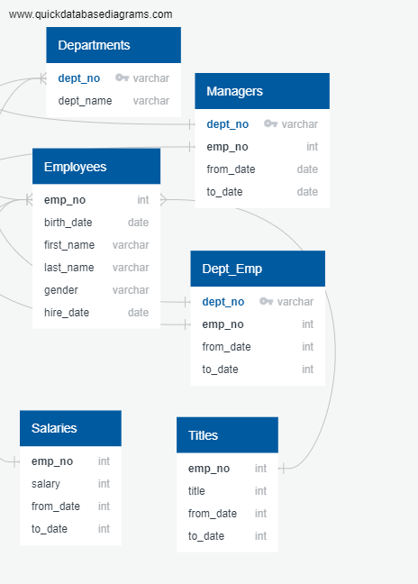

# Pewlett-Hackard-Analysis

## ERD PNG File


## Challenge: Since there are so many csv files in the folder, below are the main CSV Files to review for Challenge Deliverable 1 and Deliverable 2.
1) new_mentorship.csv
2) new_retire.csv

These two files contain the final versions that includes partition and removing duplicates.

## Delivering Results
This module was both easy and difficult. It was easy since we learned similar functions in Python. However, I did run into issues when I was using the partition function. For example, the code showed an error when I used this code:

```
-- Deliverable 1: Number of Retiring Employees by Title
SELECT e.emp_no,
	e.first_name,
	e.last_name,
	ti.title,
	sa.from_date,
	sa.salary
INTO silver_tsunami
FROM employees as e
INNER JOIN titles as ti
ON e.emp_no = ti.emp_no
INNER JOIN salaries as sa
ON e.emp_no = sa.emp_no
WHERE (e.birth_date BETWEEN '1952-01-01' AND '1955-12-31');
SELECT * FROM silver_tsunami
--TOP PORTION WORKS, BOTTOM PARTITION DOES NOT WORK
-- Partition the data to show only most recent title per employee
SELECT e.emp_no,
	e.first_name,
	e.last_name,
	ti.title,
	sa.from_date,
	sa.salary
INTO new_retire
FROM silver_tsunami
 (SELECT e.emp_no,
	e.first_name,
	e.last_name,
	ti.title,
	sa.from_date,
	sa.salary, ROW_NUMBER() OVER
 (PARTITION BY (emp_no)
 ORDER BY to_date DESC) rn
 FROM silver_tsunami
 ) 
tmp WHERE rn = 1
ORDER BY emp_no;
```
I've went to Slack to ask questions about my problem and found out that I was not referncing the table correctly. Rather than using "e.first_name", I could remove the "e." and only use "first_name". The final code is below:

```
SELECT emp_no,
	first_name,
	last_name,
	title,
	from_date,
	salary
INTO new_retire
FROM
 (SELECT emp_no,
	first_name,
	last_name,
	title,
	from_date,
	salary, ROW_NUMBER() OVER
 (PARTITION BY (emp_no)
 ORDER BY from_date DESC) rn
 FROM silver_tsunami
 ) 
tmp WHERE rn = 1
ORDER BY emp_no;
SELECT * FROM new_retire
```

Paragraph 2
In your second paragraph, summarize the steps that you took to solve the problem, as well as the challenges that you encountered along the way. This is an excellent spot to provide examples and descriptions of the code that you used.

Paragraph 3
In your final paragraph, share the results of your analysis and discuss the data that you’ve generated. Have you identified any limitations to the analysis? What next steps would you recommend?
