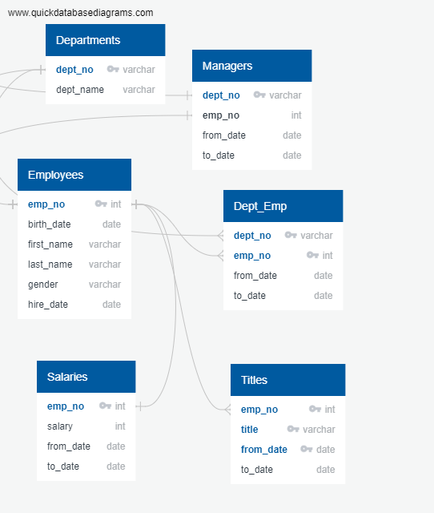

# Pewlett-Hackard-Analysis

## ERD PNG File

#Paragraph 1
In your first paragraph, introduce the problem that you were using data to solve.

Paragraph 2
In your second paragraph, summarize the steps that you took to solve the problem, as well as the challenges that you encountered along the way. This is an excellent spot to provide examples and descriptions of the code that you used.

Paragraph 3
In your final paragraph, share the results of your analysis and discuss the data that you’ve generated. Have you identified any limitations to the analysis? What next steps would you recommend?
